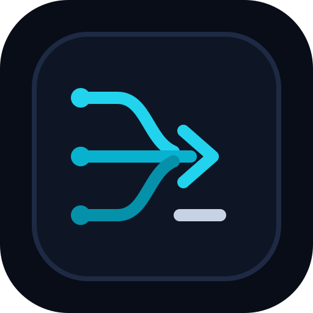

# GoWild

<p align="center">
  
</p>

GoWild is a persistent terminal runtime for coding agents where the coding CLI,
LLM gateway, and model are independent choices.

It preserves native Codex CLI and Claude Code interfaces while applying a
selected, protocol-compatible gateway to every fresh and resumed session.
MindsHub Inference is the first built-in preset; custom OpenAI
Responses-compatible and Anthropic Messages-compatible gateways use the same
adapter architecture.

## What works now

- Persistent workspaces, tabs, panes, sessions, agent status, and remote
  reattachment.
- A default Cowork-derived dark theme, a matching `cowork-light` theme, and
  host-appearance switching when enabled.
- First-run and settings-based gateway setup with secure credential references.
- Authenticated model discovery and separate defaults for Codex and Claude.
- Gateway tests for authentication, model listing, Responses, Messages,
  streaming, and tool calls.
- Managed launch and resume of the user's installed `codex` and `claude`
  executables without changing their normal config files.
- Custom gateways that expose either or both supported protocols.

Other detected coding agents still run normally, but are not yet
gateway-configurable.

## Install from source

GoWild does not publish stable binaries, hosted installers, or an update channel
yet. The current verified installation path builds this repository with the
pinned Rust toolchain and installs the `gowild` executable locally:

```bash
git clone https://github.com/ianu82/gowild.git
cd gowild
cargo install --path . --locked
gowild --version
```

The native build also needs CMake, Ninja, and Zig 0.15.2. See
[`docs/next/INSTALL.md`](docs/next/INSTALL.md) for clean-install verification,
platform notes, and removal instructions.

After starting `gowild`, complete the gateway setup in the TUI. API keys belong
in GoWild's credential flow, never in repository files or shell arguments.

## Development

```bash
just test
just check
cargo run -- --help
```

Gateway architecture and current CLI routing behavior are documented in
[`docs/next/gateways.md`](docs/next/gateways.md). Unreleased product docs live
under [`docs/next`](docs/next/README.md).

The executable and all new runtime state use the `gowild` identity. GoWild does
not read, migrate, overwrite, or silently reuse Herdr configuration or session
state. Inherited release and website automation remains disabled until a
separately reviewed GoWild-owned channel exists.

## Repository boundary

All GoWild work happens only in
[`ianu82/gowild`](https://github.com/ianu82/gowild). The Herdr project is
historical source provenance, not a collaboration target: do not send it GoWild
code, issues, pull requests, support requests, or automated syncs. See
[`PROVENANCE.md`](PROVENANCE.md) for the exact read-only imported baseline and
required attribution.

## Licence

Apache License 2.0. See [`LICENSE`](LICENSE).
