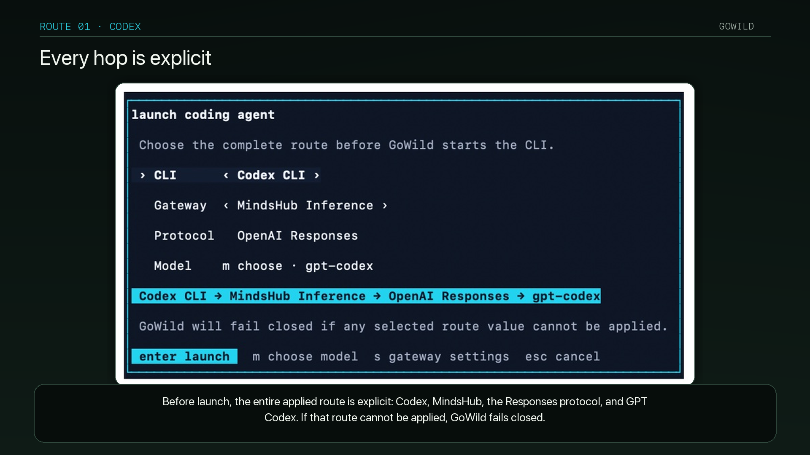

# GoWild

<p align="center">
  
</p>

[English](README.md) · 简体中文

<p align="center"><strong>继续使用你喜爱的编程智能体，自由选择推理网关和模型。</strong></p>

GoWild 是面向编程智能体的持久化终端运行时。编程 CLI、LLM 网关和模型是三个相互独立的选择。

它保留 Codex CLI 和 Claude Code 的原生界面，并为每个新建或恢复的会话应用所选的协议兼容网关。MindsHub Inference 是第一个内置预设；自定义 OpenAI Responses 兼容网关和 Anthropic Messages 兼容网关使用同一套适配器架构。

<p align="center">
  
</p>

## 当前功能

- 持久化工作区、标签页、窗格、会话、智能体状态和远程重连。
- 默认使用源自 Cowork 的深色主题，同时提供配套的 `cowork-light` 主题，并可在启用后跟随主机外观切换。
- 首次启动及设置界面中的网关配置，并使用安全的凭据引用。
- 经过身份验证的模型发现，以及 Codex 和 Claude 各自的默认模型。
- 对身份验证、模型列表、Responses、Messages、流式传输和工具调用的网关测试。
- 启动和恢复用户已安装的 `codex` 与 `claude`，且不修改其常规配置文件。
- 支持一种或两种协议的自定义网关。

其他已检测到的编程智能体仍可正常运行，但目前还不能配置网关。

## 从源代码安装

GoWild 尚未发布稳定二进制文件、托管安装程序或更新通道。目前经过验证的安装方式是使用仓库固定的 Rust 工具链构建，并在本地安装 `gowild`：

```bash
git clone https://github.com/ianu82/gowild.git
cd gowild
cargo install --path . --locked
gowild --version
```

原生构建还需要 CMake、Ninja 和 Zig 0.15.2。有关干净安装验证、平台说明和卸载方法，请参阅 [`docs/next/INSTALL.md`](docs/next/INSTALL.md)。

启动 `gowild` 后，在 TUI 中完成网关设置。API 密钥应通过 GoWild 的凭据流程保存，绝不能写入仓库文件或命令行参数。

## 开发

```bash
just test
just check
cargo run -- --help
```

网关架构和当前 CLI 路由行为记录在 [`docs/next/gateways.md`](docs/next/gateways.md) 中。未发布的产品文档位于 [`docs/next`](docs/next/README.zh-CN.md)。

可执行文件以及所有配置、会话和运行时状态都使用 `gowild` 标识。在经过单独审查的 GoWild 自有通道建立之前，导入的发布和网站自动化保持禁用。

## 仓库边界

所有 GoWild 工作、issue、PR、发布和支持仅属于 [`ianu82/gowild`](https://github.com/ianu82/gowild)。历史来源和必要归属信息集中记录在 [`ACKNOWLEDGEMENTS`](ACKNOWLEDGEMENTS/README.md) 目录中。

## 许可证

Apache License 2.0，详见 [`LICENSE`](LICENSE)。历史归属信息见 [`ACKNOWLEDGEMENTS`](ACKNOWLEDGEMENTS/README.md)。
